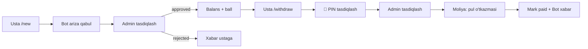

# 🌞 PowerSun Bonus — Bosh sahifa (MOC)

> [!info] Loyiha haqida
> **PowerSun v2.1** — invertor o'rnatuvchi ustalar uchun **ball-mukofot tizimi**.
> Telegram bot orqali ariza yuborish, balans yig'ish va kartaga pul yechish.
>
> **Stack:** Yii2 (PHP 8.1) + React 18 + MySQL 8 + Redis 7 + Cloudinary
> **Muddat:** 30 ish kuni · **Narx:** $800 · **Versiya:** 2.1.0

---

## 📚 Hujjatlar (vault tarkibi)

### 🎯 Asosiy hujjatlar
- [[01 - Texnik Topshiriq|📋 Texnik topshiriq]] — Mijoz uchun biznes spec
- [[02 - For Programmer|🛠️ For Programmer]] — Dasturchilar uchun texnik spec
- [[03 - RFC-001 PowerSun v2.1|📐 RFC-001]] — Arxitektura va dizayn qarorlari

### 📡 [[Contracts/00 - Contracts Index|API kontraktlar]]
Frontend ↔ Backend va Telegram Bot ↔ Backend o'rtasidagi to'liq aloqa kontrakti:

- [[Contracts/01 - Common|⚙️ Common]] — javob format, xato kodlari, paginatsiya
- [[Contracts/02 - Auth|🔑 Auth]] — login, refresh, logout
- [[Contracts/03 - Installations|📝 Installations]] — arizalar
- [[Contracts/04 - Withdrawals|💵 Withdrawals]] — chiqim so'rovlari
- [[Contracts/05 - Catalog|📦 Catalog]] — invertor, material, sozlamalar
- [[Contracts/06 - Users|👥 Users]] — ustalar va PIN reset
- [[Contracts/07 - Dashboard|📊 Dashboard]] — statistika va grafiklar
- [[Contracts/08 - Logs|📜 Logs]] — audit log
- [[Contracts/09 - Bot Webhook|🤖 Bot Webhook]] — Telegram integratsiya
- [[Contracts/10 - Bot Flows|💬 Bot Flows]] — buyruqlar va dialoglar

### 🗄️ Resurslar
- [[Resources/database.sql|MySQL Schema]] — 12 jadval, ENUM, FK, indexlar

---

## 🚀 Tezkor navigatsiya

> [!tip] Boshlash uchun
> 1. [[01 - Texnik Topshiriq|Mijoz spec]] — biznes mantiqni tushunish
> 2. [[03 - RFC-001 PowerSun v2.1|RFC]] — arxitektura va qaror sabablari
> 3. [[02 - For Programmer|Dev spec]] — texnik detallar va kod namunalari
> 4. [[Contracts/00 - Contracts Index|API kontraktlar]] — endpoint'lar

---

## 🏗️ Arxitektura qisqacha

```
┌─────────────┐         ┌──────────────┐
│ Telegram Bot│◄────────┤   api/ Yii2  │
│  (Ustalar)  │  HTTPS  │ Bot+Webhook  │
└─────────────┘         └──────┬───────┘
                               │
                               ▼
┌─────────────┐         ┌──────────────┐
│  React SPA  │◄────────┤ backend/Yii2 │
│ Admin Panel │  JWT    │ REST + RBAC  │
└─────────────┘         └──────┬───────┘
                               │
        ┌──────────────┬───────┴──────┬──────────────┐
        ▼              ▼              ▼              ▼
   ┌─────────┐    ┌─────────┐   ┌─────────┐   ┌──────────┐
   │MySQL 8  │    │ Redis 7 │   │Cloudinar│   │ Queue    │
   │ (data)  │    │(state)  │   │ (media) │   │(notify)  │
   └─────────┘    └─────────┘   └─────────┘   └──────────┘
```

---

## 🔑 Asosiy biznes oqim



---

## 🔐 PIN-kod tizimi (yangi)

> [!warning] PIN bilan tasdiqlash
> Chiqim so'rovi yuborishda usta **4 raqamli PIN-kod** kiritishi shart.
>
> - Birinchi marta: `/set_pin` orqali o'rnatiladi
> - 3 noto'g'ri urinish → 30 daqiqaga lockout
> - Unutilsa: `/reset_pin` → admin telefonda tasdiqlab reset qiladi
> - bcrypt hash bilan saqlanadi, raw ko'rinishda hech qayerda turmaydi
> - Bot PIN matnli xabarni darhol `deleteMessage` orqali o'chiradi

Batafsil: [[Contracts/06 - Users#5. PIN RESET (Admin orqali)|PIN reset]] · [[Contracts/10 - Bot Flows#7. /set_pin|set_pin flow]]

---

## 📐 Texnologik stek

| Qatlam | Texnologiya | Versiya |
|--------|-------------|---------|
| Backend | PHP + Yii2 Advanced | 8.1+ / 2.0.50 |
| Frontend | React + Vite + Ant Design | 18 / 5 / 5 |
| Database | MySQL InnoDB | 8.0+ |
| Cache | Redis | 7+ |
| Storage | Cloudinary | 2.0 |
| Auth | JWT (firebase/php-jwt) | 15m + 7d |
| Queue | yii2-queue (Redis) | 2.3 |
| CI/CD | GitHub Actions | — |

---

## 📅 Bosqichlar

| # | Bosqich | Muddat | Status |
|---|---------|--------|--------|
| 1 | Asos (server, DB, Yii2) | 1–3 kun | ⬜ |
| 2 | Telegram bot | 4–10 kun | ⬜ |
| 3 | Backend mantiq | 11–17 kun | ⬜ |
| 4 | Admin panel | 18–26 kun | ⬜ |
| 5 | Test + Deploy | 27–30 kun | ⬜ |

---

## 🏷️ Tag'lar

#powersun · #api · #bot · #pin · #rfc · #spec · #moc

---

## 🔗 Bog'lanishlar (Backlinks)

> Pastda bu sahifaga ishora qiladigan barcha hujjatlar avtomatik ko'rsatiladi (Obsidian Backlinks pane).

---

> [!note] Ushbu vault haqida
> Bu **Obsidian vault**. `Ctrl+O` bilan har qanday faylga o'tish, `Ctrl+E` bilan tahrir/preview almashtirish, `Ctrl+G` bilan grafik ko'rinish.
> Wiki-link sintaksisi: `[[Fayl nomi]]` yoki `[[Fayl nomi|alias]]`.
